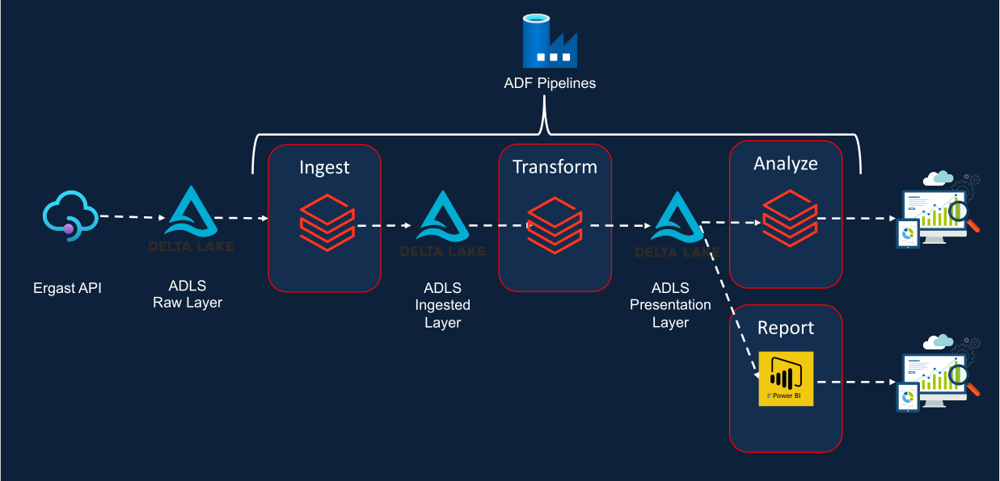

# Introduction

The project processes Formula 1 data from 1950 - 2021 that supports both full and incremental load into a medallion architecture. Data is extracted to loaded into Azure Data Lake Gen 2 between layers. Delta Lake is utilized to provide ACID properties to Spark Tables. The pipeline is orchestrated using Azure Data Factory.

# Architecture

